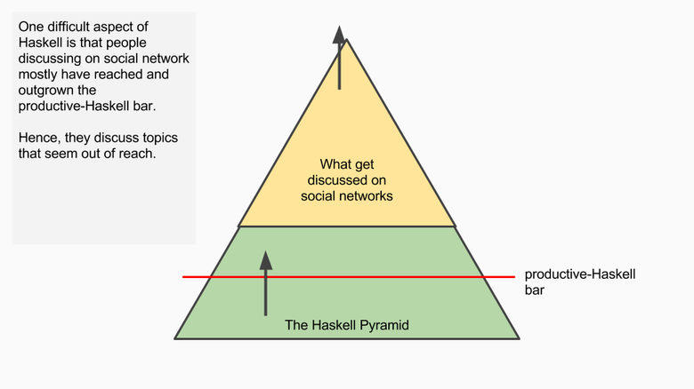
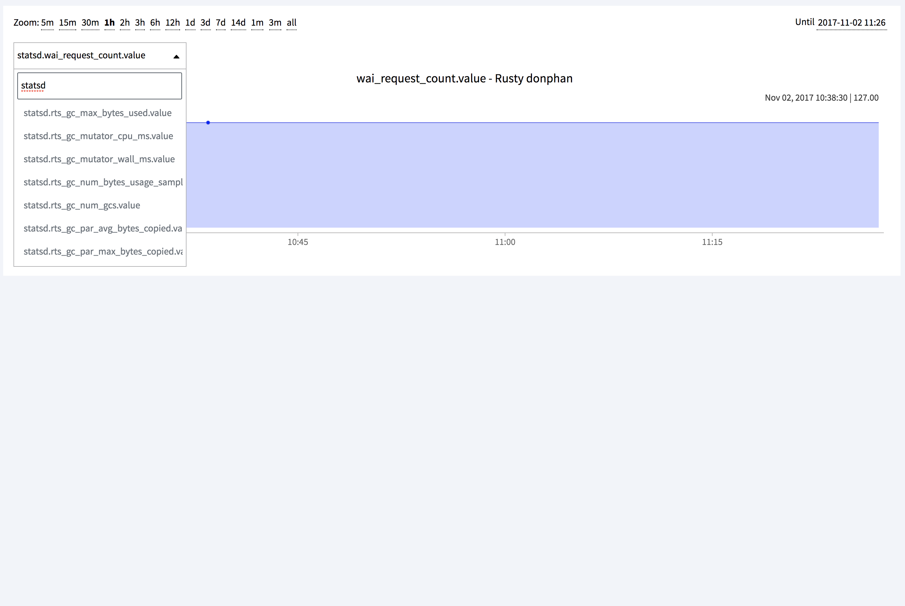

# Who are we?

- Clément Delafarque, CTO Clever Cloud, a PaaS.
- Frédéric Menou, CTO FretLink, a Markeplace in freight.

--------------------------------------------------------------------------------

<!-- Frédéric -->
<!-- Why Haskell? Examples of stuff done in 1 year -->

## Why Haskell?

<details role="note">
A lot of parsing (parser combinators <3).

A leap of faith.

Haskell as a teaching tool for FP to write better code.
</details>

--------------------------------------------------------------------------------

<!-- Frédéric -->
<!-- It started with some CLIs -->

## Command-Line Tools

<details role="note">
October 2016

Migration tool for Emails (OVH -> Gmail). A CLI. Mostly IO + Maybe.

- consume HTTP APIs

- handle UTF-8 strings

- be idempotent

- parse some exotic data files.

Refactoring from existing codebase written for YouTube APIS: ADTS + Aeson.

Never touch it again, still used right now in a larger CLI calling providers
APIs left & right.
</details>

--------------------------------------------------------------------------------

<!-- Frédéric -->
<!-- Then some tooling with Google Sheet -->

## APIs + Google Sheets = <3

<details role="note">
March 2017

First actual HTTP service in Haskell, consuming GMaps API and OSRM APIs.

[Screenshot of distance computation tool integrated in Google Sheet]

Wrote once, forgot about it, and it's still working (in CleverCloud <3).

Added Redis cache by wrapping an IO method.

CLI converted to HTTP service (changing the main mostly).
</details>

--------------------------------------------------------------------------------

# 

--------------------------------------------------------------------------------

<!-- Then some tooling with Google Sheet -->

<!-- Frédéric -->
<!-- Finally HTTP services in production -->

## HTTP with Servant

<details role="note">
June 2017

With more experience regarding Haskell code and the benefit you can got, the
idea to migrate actual production code to a fresh version in pure Haskell was
finally taken, following the arrival of a new developer.
</details>

--------------------------------------------------------------------------------

<!-- Frédéric -->

## Consuming Databases

--------------------------------------------------------------------------------

<!-- Frédéric -->

## Serving data

--------------------------------------------------------------------------------

<!-- Frédéric -->

## Supporting back-office functions

--------------------------------------------------------------------------------

<!-- Frédéric -->
<!-- Finally HTTP services in production -->

## Business rules should be readable

<details role="note">
With more experience regarding Haskell code and the benefit you can got, the
idea to migrate actual production code to a fresh version in pure Haskell was
finally taken, following the arrival of a new developer.

The first service was domain specific and important part of the code should be
expressive enough for some expert to review it. In our case our expert is our
Product Manager who is not developer at all.

You can avoid implementing EDSL just by writing proper Haskell code. The
challenge here is to split the logic from the plumbing such IO, HTTP,
Filesystem, error handling.

More services follow since then and we have gained experience about implementing
a whole HTTP service in Haskell from the source to the production. Let us
present that to you.
</details>

--------------------------------------------------------------------------------

<!-- Day to day -->
# day-to-day: how do you code in Haskell, and test it?

<!-- Frédéric -->
<!-- Make it compile -->

<details role="note">
It ain't easy at first. Exotic compile error messages can be very frightening at
the beginning.

Make it work and you can forget about it for months. You'll get back to it later.

The key is to start with some ugly code. Don't hesitate to mix IO with logic, to
badly name things, to use type aliases. Your job is to draw the baseline of your
code, you'll make it solid and pretty in the next step.
</details>

--------------------------------------------------------------------------------

<!-- Frédéric -->
<!-- Abstractions, elegant solutions: avoid code-golf -->

## Write dirty code

<details role="note">
Your job is to write code that's working. Then you refactor, affine the concepts.
</details>

--------------------------------------------------------------------------------

## but it should work!

<details role="note">
</details>

--------------------------------------------------------------------------------

## Code-golf is bad

<details role="note">
Your job is to write code that's working. Then you refactor, affine the concepts.

It's pretty common for Haskell developers to fill overwelm by all the advanced
topics discussed in Reddit [reddit-haskell] or the wiki. But you don't need
those to write useful code. Lucas Di Cioccio call it the Haskell Pyramid [haskell-pyramid].

[reddit-haskell]: https://www.reddit.com/r/haskell
[haskell-pyramid]: https://patrickmn.com/software/the-haskell-pyramid/

Types, properties, module separation (and git) are the best tool to write
production-ready software.

[Examples of Quickcheck properties to express behavior]

[Rant about Uncle Bob opposing types and tests?]
</details>

--------------------------------------------------------------------------------

## Usable code is simple

--------------------------------------------------------------------------------



<div style="z-index: 2000; position: absolute; bottom: 2em">
credits: Lucas Di Cioccio
</div>

--------------------------------------------------------------------------------

## Don't be the Kmett

--------------------------------------------------------------------------------


<div style="z-index: 2000; position: absolute; top: -1em">
https://cokmett.github.io/cokmett
</div>

--------------------------------------------------------------------------------

<!-- Frédéric -->
<!-- Libraries and documentation -->

<details role="note">
When building a Haskell project, you would most likely use Cabal or stack
(which wraps Cabal with a notion of distribution of deps).

With Cabal, packages are available in [hackage]. Stack handle various
distributions of packages in its own repository [stackage]. You can forget about
Stackage and consider Hackage the reference. Documentation is also available in
those web sites, generated from the source code with haddock (same way javadoc
and other do).

[hackage]: https://hackage.haskell.org
[stackage]: https://www.stackage.org/

One very cool feature of the Haskell ecosystem is [hoogle], a search engine
for functions and types, indexing most packages from hackage, and letting you
search for functions by passing a signature. Hoogle is an API so you can easily
use in your terminal or your IDE.

[hoogle]: https://www.haskell.org/hoogle/
</details>

------------------------------------------------------------------------------

<!-- Clément -->
## ADT

------------------------------------------------------------------------------

```scala
case class Peer(
  cidrs: List[String],
  pubkey: String,
  endpoint: String,
  keepalive: Int)
```

------------------------------------------------------------------------------

```scala
sealed trait WgCommand
case class InitConfig(…)
  extends WgCommand
case class SetPeer(peer: Peer)
  extends WgCommand
case class RemovePeer(pubkey: String)
  extends WgCommand
```

------------------------------------------------------------------------------

```haskell
data Peer = Peer
  { cidrs :: [Text]
  , pubkey :: Text
  , endpoint :: Text
  , keepalive :: Int
  }
```

------------------------------------------------------------------------------

```haskell
data WgCommand =
    InitConfig Text Text Text Int
    SetPeer Peer
    RemovePeer Text
```

------------------------------------------------------------------------------

```scala
def handleCommand(c: WgCommand) = c match {
  case InitConfig(_) => ???
  case SetPeer(peer) => ???
  case RemovePeer(pubkey) => ???
}
```

------------------------------------------------------------------------------

```haskell
{-# LANGUAGE DuplicateRecordFields #-}
{-# LANGUAGE RecordWildCards       #-}

handleCommand :: Command -> IO ()
handleCommand InitConfig{..} = error "ToDo"
handleCommand SetPeer{..} = error "ToDo"
handleCommand RemovePeer{..} = error "ToDo"
```

------------------------------------------------------------------------------

## Typeclasses

------------------------------------------------------------------------------

```haskell
class Monoid a where
        mempty  :: a
        mappend :: a -> a -> a
        mconcat :: [a] -> a
        mconcat = foldr mappend mempty
```

------------------------------------------------------------------------------

```haskell
instance Monoid Ordering where
        mempty         = EQ
        LT `mappend` _ = LT
        EQ `mappend` y = y
        GT `mappend` _ = GT
```

------------------------------------------------------------------------------

## Convergence

------------------------------------------------------------------------------

## Orphan Instances

------------------------------------------------------------------------------

## Hole-Driven Development

------------------------------------------------------------------------------

```scala
trait Hole
case object Hole_

def compose[A,B,C](
    f: A => B,
    g: B => C
): (A => C) = Hole_
```

------------------------------------------------------------------------------

```haskell
compose :: (a -> b) -> (b -> c) -> (a -> c)
compose = _
```

------------------------------------------------------------------------------

<!-- Clément -->
## Tooling

------------------------------------------------------------------------------

<!-- Clément -->
## Devloop

------------------------------------------------------------------------------

<small><small>
```javascript
'use strict'

let compile = run({
  sh: 'stack build',
  watch: '*.hs'
})

let server = runServer({
  httpPort,
  env: { "PORT": httpPort },
  sh: `./.stack-work/*/*/*/*/bin/cestpasnous`
}).dependsOn(compile)

proxy(server, 8080).dependsOn(compile)
```
</small></small>

------------------------------------------------------------------------------

<!-- Clément Production? -->
# Haskell in Production

<details role="note">
stressant par rapport à java, mais finalement pas si méchant
</details>

------------------------------------------------------------------------------

## Build: <3 stack LTS && lockfile

<details role="note">
Même build pour tout le monde, build automatisable et robuste
</details>

------------------------------------------------------------------------------

## Single binary

<details role="note">
Easy for CLI tooling, stuff like that
</details>

------------------------------------------------------------------------------

## Dependencies caching

<details role="note">
Essential for continuous deployment.
</details>

------------------------------------------------------------------------------

## Monitoring && metrics: <3 EKG

<details role="note">
EKG way easier to use than JMX (IMO).
Easy to integrate in statsd, prometheus, pure HTTP
Dashboard available
</details>

------------------------------------------------------------------------------


------------------------------------------------------------------------------




<!-- Beyond the PoC -->
# Haskell beyond the PoC : maintenance, hiring, training

--------------------------------------------------------------------------------

<!-- Frédéric -->
<!-- Refactor all the things! Let the compiler guide you -->


--------------------------------------------------------------------------------

## Split IO from pure code

--------------------------------------------------------------------------------

## Name things properly

--------------------------------------------------------------------------------

## Isolate implementation in modules

--------------------------------------------------------------------------------

## even a lot of modules

--------------------------------------------------------------------------------

## Write your own monads ;)

--------------------------------------------------------------------------------

<details role="note">
Remember: the plan was to make it work. When POCing something, we have a lot
of minimal requirements to match. For instance we want it to not blow up when
it's released; to be reviewed by our peers; to be tested; to be stable.

That's a lot of hard things to do.

When it's done it's very likely you had the chance to better understand what
you had to do, to name concepts, to find better frontier in your code.

Personally I see refactoring as a very peaceful and rewarding task. Its my zen
garden where I careful move this whole piece of code to a proper module; where
I limit the interface of a module by listing the single two functions it's
really exposing; where I rename my datatypes with more accurate names having
gained a deeper understanding of what's going on there.

All those tasks are harmless in Haskell. You rename the function at its
definition and you wait for GHC to yell at you for every single places you have
to change it. Obviously it's much more enjoyable if your text editor support
tooling.
</details>

--------------------------------------------------------------------------------

<!-- Frédéric -->
<!-- The compiler loves you, but sometimes you'd like to trow it out -->

## The compiler is your best friend

<details role="note">
To be honest, compilation errors may be very unhelpful when you don't know some
theory. One of the biggest weakness of Haskell nowadays. There's hope for future
releases of GHC to be more accurate and to emphasize what's wrong or give advice.

Even though the errors are currently pretty verbose, you can already take
advantage of those to find some hints. In various occasions GHC can give you
what you should had written.
</details>

--------------------------------------------------------------------------------

<!-- Frédéric -->
<!-- Performance: the issue? Laziness, memory management, GC pauses -->

## Laziness can be tricky

--------------------------------------------------------------------------------

## bust mostly for IO

--------------------------------------------------------------------------------

## Use pipes for lazy IO

<details role="note">
When you write Haskell code for the first time, you will most likely fell in
the common trap of laziness and the consequences for your runtime.

Haskell code is declarative, expressing what you want to obtain from the machine
rather than telling the machine what to do (imperative code).

This results in expressions where you can't tell how it's evaluated and how
the memory will be used. Laziness is the evil in the box for beginners because
you will most likely produce code requiring a lot of memory before producing a
single result.

The main consequence is that you software might pause in GC or even worse fail
in OOM.
</details>

--------------------------------------------------------------------------------

<!-- Frédéric -->
<!-- Hiring: train them, don't hire them -->

## Good developers like abstraction, polymorphism

<details role="note">
I stopped hiring Ruby developers at Captain Train, I only hired good developers.
Hire people willing to get some certainty about their code, and they will very
likely understand and love Haskell.

Your job if you want to introduce Haskell in a existing team is to find allies
in the quest of abstraction and code factorization. Purity and parallelism may
also be good leads for that, but most of the time a given team want to reduce
runtime errors.

In France universities and high schools teach C, Java but also some OCaml
because of INRIA. I know people that had the occasion to look at some Coq proofs
but they all went running from that, yelling and pledging they will never touch
it again. Disappointing but very realistic.

Most of the time you'll need to stick to the classic frontend background with
mostly Javascript. And you can take advantage of ES6 and libs such as Lodash, or
even framework like React, Ember, Vue to lure them in the sweat world of pure
functions.

So peek good developers, involved in code quality, and make them realize they
can enjoy Haskell to write better code, even in their original language.
</details>

--------------------------------------------------------------------------------

<!-- Frédéric -->
<!-- Training: Haskell as a way to better understand complex systems -->

## Haskell purity as a blessing

<details role="note">
How purity, explicit IO, Functor/Applicative help you understand what's going
on. Being force to split effects, control structures, pure logic code, is very
sound and will help one express his ideas.

Let the trainee see the structure and go back to a more comfortable language.
He/she will go back to Haskell willing to get back all this safety and
expressiveness.
</details>

<!-- Future -->
# Future of the language

<!-- Frédéric -->
<!-- Elm, Purescript: other ways to write good software -->

## Elm or Purescript for the web

<details role="note">
OK that's not exactly the future. It's already there and it will live along with
Haskell.

You can see Elm has a good way to convince people about the benefit of purely
FP languages without all of the base knowledge required to write working
Haskell code. An experience developer might prefer Purescript to write web UIs.

Purescript is much more a Haskell made to run in the browser. This is still
pretty new and every version is making deep changes in the APIs or the language
itself. For instance it move back to IO for effects, ditching the row-based
effects, converging in that very topic to Haskell.

Purescript comes along with psc, kind of its stack. This is very interesting
for web development since Javascript isn't known for its successes in deps
management.
</details>

--------------------------------------------------------------------------------

<!-- Frédéric -->
<!-- Servant to document your APIs, even if you're not writing Haskell code -->

## Servant to generate docs

--------------------------------------------------------------------------------

## or generate clients

<details role="note">
I talked a bit of Servant. This is a very cool library if you're ok with
advanced compiler extensions.

Imagine the routes you're used to write when implementing a web service in
almost every modern framework. You'll most likely express that a given URL
reacts to some HTTP verb, with some capture in the url, usely this way:

```javascript
# In express (javascript):
app.get("/api/v1/user",     listUsersHandler);
app.get("/api/v1/user/:id", getUserHandler);
```

That's sweet. But you can do more, and an API specification is much more than
the URL + Verb. It's all the capture and query parameters, the headers, the
accept-types, the body and response content.

Servant let's you describe what a HTTP endpoint does, without choosing a side.
My first Servant APIs was to consume existing APIs (remember Google Maps I
talked in the beginning?). I have no control on them and didn't plan to
implement them.

So if you are exposing APIs in Scala, consuming them in Javascript, letting some
third-part consume them in php, you may want to have a common way to document
them.

There is a module [servant-swagger] capable to produce a swagger.json from an API.

[servant-swagger]: https://hackage.haskell.org/package/servant-swagger

We plan also to write generated clients in Purescript or Javascript for our
internal frontend codebases.

For more about Servant, the [docs [servant-tutorial] and a good introduction [servant-introduction]

[servant-tutorial]: http://haskell-servant.readthedocs.io/
[servant-introduction]: https://www.youtube.com/watch?v=gMDiKOuwLXw
</details>

--------------------------------------------------------------------------------

Servant tutorial: [](http://haskell-servant.readthedocs.io)

--------------------------------------------------------------------------------

An Introduction to Servant: [](https://www.youtube.com/watch?v=gMDiKOuwLXw)

--------------------------------------------------------------------------------

<!-- Frédéric -->
<!-- GHC 8.4, Dependent Types, Linear Types: the language is evolving -->

## GHC 8.4

--------------------------------------------------------------------------------

## Dependent Types

--------------------------------------------------------------------------------

## Linear Types

--------------------------------------------------------------------------------

## quite alive for an old language

<details role="note">
Microsoft, Facebook and some banks are actively supporting the developpement of
Haskell and its future. Releases of GHC are keeping a good pace of one every
18 months.

We had some example of very neat collaboration to refactor some of the base API
of the language with the introduction of the Applicative as a common base for
every Monad in GHC 7.10.1. [AMP]

[AMP]: https://github.com/quchen/articles/blob/master/applicative_monad.md

[Insert some rant about Odersky and the way Scala is stuck to its JVM roots?]

Some advanced concept such dependent types [dep-types-1] [dep-types-2] or linear
types will at some point be standard in Haskell, making it the best choice to
experiment advanced concepts as it was at the beginning.

[dep-types-1]: https://www.reddit.com/r/haskell/comments/4uamzt/countdown_to_fully_dependent_types/
[dep-types-2]: https://typesandkinds.wordpress.com/2016/07/24/dependent-types-in-haskell-progress-report/
</details>

--------------------------------------------------------------------------------

<!-- Clément & Frédéric -->
# Some conclusion?
